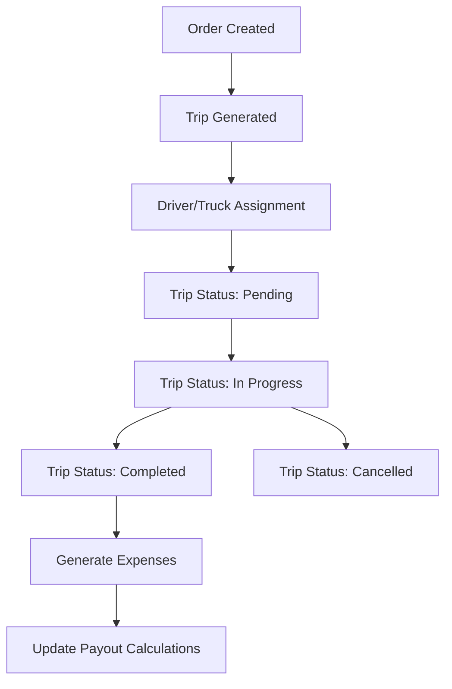
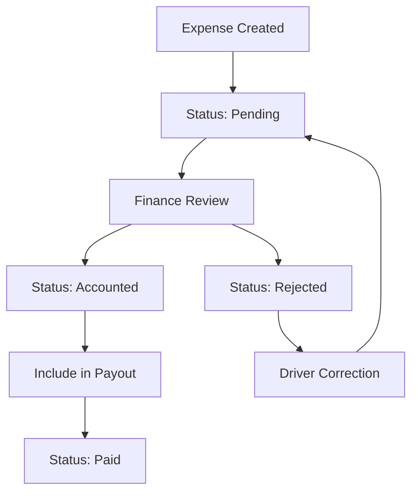
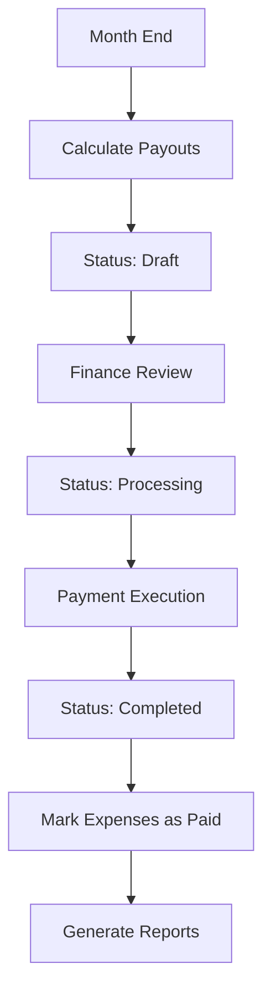
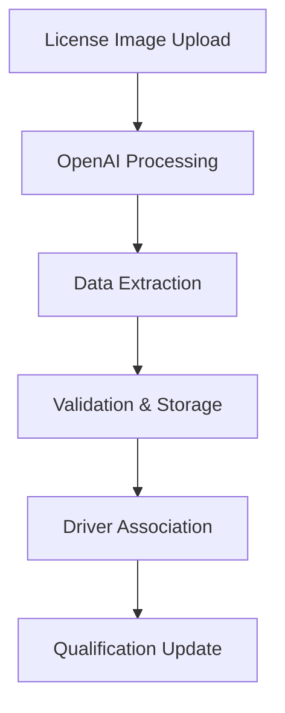
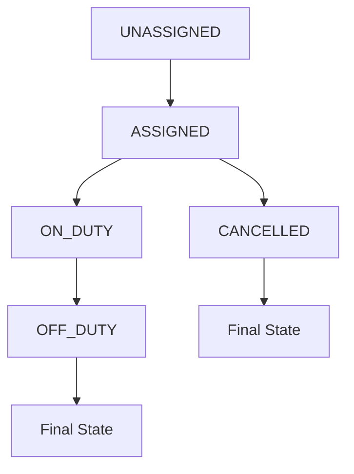
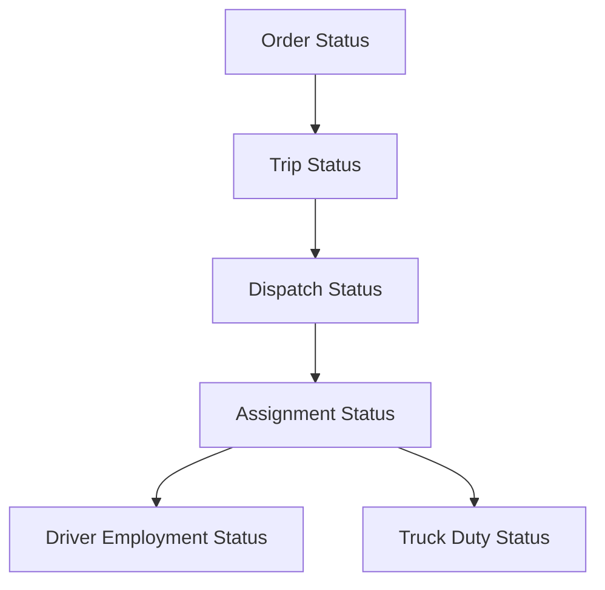

# MDH (MyDispatchHub) - Comprehensive Project Documentation

## Table of Contents
1. [Project Overview](#project-overview)
2. [Technology Stack](#technology-stack)
3. [System Architecture](#system-architecture)
4. [Core Modules](#core-modules)
5. [Data Models](#data-models)
6. [Business Workflows](#business-workflows)
7. [API Documentation](#api-documentation)
8. [Deployment Guide](#deployment-guide)
9. [User Guide](#user-guide)
10. [Development Guidelines](#development-guidelines)
11. [Troubleshooting](#troubleshooting)

---

## Project Overview

**MDH (MyDispatchHub)** is an AI-powered SaaS application designed for comprehensive dispatch management in the transportation industry. The system provides end-to-end fleet management, dispatch coordination, expense tracking, and financial reporting capabilities.

### Key Features
- **Fleet Management**: Vehicle and driver management with real-time status tracking
- **Dispatch System**: Trip planning, order management, and route optimization
- **Expense Management**: Fuel tracking (BVD), expense reporting, and reimbursement workflows
- **Financial Management**: Driver payouts, commission calculations, and currency conversion
- **Multi-Tenancy**: Support for multiple companies with data isolation
- **AI Integration**: OpenAI integration for license processing and document analysis
- **Real-time Updates**: WebSocket support via Django HTMX for dynamic UI updates

### Target Users
- **Transportation Companies**: Fleet operators managing multiple vehicles and drivers
- **Dispatch Managers**: Coordinating trips and optimizing routes
- **Drivers**: Submitting expenses and tracking payments
- **Finance Teams**: Managing payouts and expense approvals
- **Administrators**: System configuration and user management

---

## Technology Stack

### Backend Framework
- **Django 5.1.2**: Main web framework
- **Python 3.12+**: Programming language
- **PostgreSQL**: Primary database (with SQLite fallback for development)
- **Redis**: Caching and session storage

### Asynchronous Processing
- **Celery**: Background task processing
- **Celery Beat**: Scheduled task management
- **Flower**: Celery monitoring interface

### Frontend Technologies
- **Django Templates**: Server-side rendering
- **Bootstrap 5**: CSS framework for responsive design
- **HTMX**: Dynamic frontend interactions without JavaScript frameworks
- **Crispy Forms**: Enhanced form rendering
- **Django Tables2**: Advanced table rendering with sorting/filtering

### Infrastructure & Deployment
- **Docker & Docker Compose**: Containerization
- **Gunicorn**: WSGI server for production
- **WhiteNoise**: Static file serving
- **Caddy**: Reverse proxy and SSL termination
- **AWS Services**: Cloud deployment platform

### Development Tools
- **UV**: Fast Python package manager
- **Pre-commit**: Code quality hooks
- **Ruff**: Python linting and formatting
- **Safety & Bandit**: Security scanning
- **Debug Toolbar**: Development debugging

### Third-Party Integrations
- **OpenAI API**: AI-powered document processing
- **AWS S3**: File storage
- **Plotly**: Data visualization
- **WeasyPrint**: PDF generation

---

## System Architecture

### High-Level Architecture

```
┌─────────────────┐    ┌─────────────────┐    ┌─────────────────┐
│   Load Balancer │    │   Web Servers   │    │   Background    │
│    (Caddy)      │────│    (Django)     │────│   Workers       │
│                 │    │                 │    │   (Celery)      │
└─────────────────┘    └─────────────────┘    └─────────────────┘
                                │                       │
                       ┌─────────────────┐    ┌─────────────────┐
                       │   Database      │    │     Cache       │
                       │ (PostgreSQL)    │    │    (Redis)      │
                       └─────────────────┘    └─────────────────┘
```

### Application Structure

```
mdh/
├── web/                    # Main Django application
│   ├── mdh/               # Project settings and configuration
│   ├── models/            # Base models and common utilities
│   ├── tenant/            # Multi-tenancy management
│   ├── fleet/             # Vehicle and driver management
│   ├── dispatch/          # Trip and order management
│   ├── expense/           # Expense tracking and payouts
│   ├── customer/          # Customer management
│   ├── subscriptions/     # Subscription and billing
│   ├── templates/         # HTML templates
│   └── static/           # CSS, JS, and media files
├── compose.yaml          # Docker composition
├── Makefile             # Development commands
└── scripts/             # Deployment and utility scripts
```

---

## Core Modules

### 1. Tenant Module (`tenant/`)
**Purpose**: Multi-tenant architecture support

**Key Components**:
- `Tenant`: Company/organization management
- `Profile`: User profile with tenant association and role-based access
- `Role`: User permission levels (Regular User, Admin, Super Admin)

**Features**:
- Data isolation between tenants
- User role management
- Subscription integration

### 2. Fleet Module (`fleet/`)
**Purpose**: Vehicle and driver management

**Key Components**:
- `Truck`: Vehicle information and status tracking
- `Driver`: Driver profiles and licensing
- `DriverLicense`: AI-processed license information
- `DriverEmployment`: Employment status and duty management
- `Carrier`: Transportation company information

**Features**:
- Real-time vehicle status tracking
- Driver qualification validation
- License expiration monitoring
- Employment status management

### 3. Dispatch Module (`dispatch/`)
**Purpose**: Trip planning and order management

**Key Components**:
- `Order`: Customer orders and requirements
- `Trip`: Individual trip instances
- `DriverTruckAssignment`: Resource allocation
- `StatusHistory`: Change tracking and audit trails
- `Notification`: System notifications

**Features**:
- Trip status workflow management
- Route planning and optimization
- Real-time status updates
- Assignment validation

### 4. Expense Module (`expense/`)
**Purpose**: Financial tracking and driver payments

**Key Components**:
- `BVD`: Bulk Vehicle Data (fuel expenses)
- `OtherExpense`: Non-fuel expenses
- `Payout`: Monthly driver payments
- `ExchangeRate`: Currency conversion

**Features**:
- Automated fuel expense import
- Multi-currency support
- Complex payout calculations
- Expense approval workflows

### 5. Customer Module (`customer/`)
**Purpose**: Client relationship management

**Features**:
- Customer profile management
- Order history tracking
- Communication logs

### 6. Subscriptions Module (`subscriptions/`)
**Purpose**: SaaS billing and subscription management

**Features**:
- Subscription plan management
- Usage tracking
- Billing integration

---

## Data Models

### Base Model Structure

All models inherit from `BaseModel` which provides:
```python
class BaseModel(models.Model):
    id = models.UUIDField(primary_key=True, default=uuid.uuid4, editable=False)
    created_at = models.DateTimeField(auto_now_add=True)
    updated_at = models.DateTimeField(auto_now=True)
    deleted_at = models.DateTimeField(null=True, blank=True)
    is_active = models.BooleanField(default=True)
```

### Key Model Relationships

#### Fleet Models

**Truck Model**:
- Core vehicle information (unit number, VIN, make, model)
- Status tracking (Active, Inactive, Maintenance, Retired)
- Ownership details (Owned, Rented, Leased)
- Operational information (capacity, weight, fuel details)
- Tenant association for multi-tenancy

**Driver Model**:
- Personal information (name, contact details, address)
- Employment details (hire date, employee ID)
- License association and validation
- Carrier assignment

**DriverEmployment Model**:
- Employment status (Active, Inactive, On Leave, Terminated)
- Duty status (Available, On Duty, Unassigned)
- Current assignment tracking
- Location history

#### Dispatch Models

**Trip Model**:
- Trip identification and planning details
- Distance and duration estimates vs. actuals
- Cost tracking (fuel, tolls, freight)
- Status workflow (Pending, In Progress, Completed, Cancelled)
- Multi-currency support

**Order Model**:
- Customer requirements and specifications
- Pickup and delivery details
- Priority and special instructions
- Order status tracking

#### Expense Models

**BVD (Bulk Vehicle Data) Model**:
- Fuel transaction details from external systems
- Tax breakdown (PST, GST, HST, QST)
- Station information and transaction tracking
- Duplicate prevention through unique constraints

**OtherExpense Model**:
- Non-fuel expenses with categorization
- Receipt management and vendor information
- Reimbursement workflow support
- Tax calculation and payment method tracking

**Payout Model**:
- Monthly driver payment calculations
- Multi-currency revenue and expense totals
- Exchange rate application
- Status workflow for payment processing

### Status Enumerations

The system uses comprehensive status enumerations for workflow management:

#### TripStatus
- `PENDING`: Initial state, planning phase
- `IN_PROGRESS`: Trip is active
- `COMPLETED`: Trip finished successfully
- `CANCELLED`: Trip was cancelled

#### AccountPayableStatus
- `PENDING`: Expense recorded, awaiting review
- `ACCOUNTED`: Approved for payment inclusion
- `PAID`: Payment completed

#### ReimbursementStatus
- `PENDING`: Awaiting approval
- `APPROVED`: Approved for reimbursement
- `REJECTED`: Not eligible for reimbursement
- `PAID`: Reimbursement completed

#### PayoutStatus
- `DRAFT`: Calculation complete, not finalized
- `PROCESSING`: Payment in progress
- `COMPLETED`: Payment finished
- `CANCELLED`: Payout cancelled

---

## Business Workflows

### 1. Trip Management Workflow



**Process Description**:
1. Customer places order through the system
2. Trip is automatically generated from order requirements
3. Dispatch assigns qualified driver and available truck
4. Trip moves through status workflow
5. Completion triggers expense generation and payout updates

### 2. Expense Management Workflow



**Process Description**:
1. Expenses created automatically (BVD) or manually (Other)
2. Finance team reviews and approves expenses
3. Approved expenses included in monthly payout calculations
4. Payment completion marks expenses as paid

### 3. Driver Payout Workflow



**Process Description**:
1. Monthly automated payout calculation
2. Finance review and approval
3. Payment processing initiation
4. Automatic expense status updates
5. Report generation for audit trails

### 4. License Processing Workflow



**Process Description**:
1. Driver uploads license image
2. AI processes and extracts information
3. System validates and stores data
4. Updates driver qualification status

---

## API Documentation

### Authentication
The system uses Django's built-in session authentication with tenant isolation.

### Key API Endpoints

#### Fleet Management
```
GET /fleet/drivers/                 # List drivers
POST /fleet/drivers/                # Create driver
GET /fleet/drivers/{id}/            # Driver details
PUT /fleet/drivers/{id}/            # Update driver
DELETE /fleet/drivers/{id}/         # Delete driver

GET /fleet/trucks/                  # List trucks
POST /fleet/trucks/                 # Create truck
GET /fleet/trucks/{id}/             # Truck details
PUT /fleet/trucks/{id}/             # Update truck
```

#### Dispatch Management
```
GET /dispatch/trips/                # List trips
POST /dispatch/trips/               # Create trip
GET /dispatch/trips/{id}/           # Trip details
PUT /dispatch/trips/{id}/status/    # Update trip status

GET /dispatch/orders/               # List orders
POST /dispatch/orders/              # Create order
```

#### Expense Management
```
GET /expense/bvd/                   # List BVD expenses
POST /expense/bvd/import/           # Import BVD data
GET /expense/other/                 # List other expenses
POST /expense/other/                # Create expense

GET /expense/payouts/               # List payouts
POST /expense/payouts/calculate/    # Calculate payout
PUT /expense/payouts/{id}/status/   # Update payout status
```

#### Status Management
```
POST /expense/status/{model}/{id}/  # Update expense status
GET /expense/status-options/{model}/{id}/ # Get valid status transitions
```

### Response Formats

All API responses follow a consistent JSON structure:
```json
{
    "success": true,
    "data": {...},
    "message": "Operation completed successfully",
    "errors": []
}
```

Error responses:
```json
{
    "success": false,
    "data": null,
    "message": "Validation failed",
    "errors": [
        {
            "field": "license_number",
            "message": "This field is required"
        }
    ]
}
```

---

## Deployment Guide

### Prerequisites
- Docker and Docker Compose
- Python 3.12+
- PostgreSQL 17+
- Redis 7+
- AWS Account (for production)

### Environment Configuration

Create `.env` file in `web/` directory:
```bash
# Database
DB_MODE=postgresql
DB_NAME=mdh
DB_USER=mdh
DB_PASSWORD=your_secure_password
DB_HOST=db
DB_PORT=5432

# Security
SECRET_KEY=your_secret_key_here
DEBUG=False
ALLOWED_HOSTS=yourdomain.com,www.yourdomain.com

# External Services
OPENAI_API_KEY=your_openai_key
AWS_ACCESS_KEY_ID=your_aws_key
AWS_SECRET_ACCESS_KEY=your_aws_secret
AWS_STORAGE_BUCKET_NAME=your_bucket_name

# Email Configuration
EMAIL_HOST=smtp.yourdomain.com
EMAIL_PORT=587
EMAIL_HOST_USER=noreply@yourdomain.com
EMAIL_HOST_PASSWORD=your_email_password

# Redis
REDIS_URL=redis://redis:6379/0
```

### Development Setup

1. **Clone Repository**:
```bash
git clone https://github.com/yourusername/mdh.git
cd mdh
```

2. **Install Dependencies**:
```bash
pip install -U uv
cd web && uv sync --frozen
cd ../ && uv run pre-commit install
```

3. **Start Development Environment**:
```bash
make dev-build dev-up
make dev-migrate dev-createsuperuser
make dev-logs-web
```

### Production Deployment

1. **Build Production Images**:
```bash
make prod-build
```

2. **Deploy Services**:
```bash
make prod-up
make prod-migrate
```

3. **Set Up SSL**:
Configure Caddy for SSL termination in `Caddyfile`:
```
yourdomain.com {
    reverse_proxy web:8000
}
```

4. **Configure System Services**:
```bash
sudo cp mdh.service /etc/systemd/system/
sudo cp mdh-worker.service /etc/systemd/system/
sudo cp mdh-beat.service /etc/systemd/system/
sudo systemctl enable mdh mdh-worker mdh-beat
sudo systemctl start mdh mdh-worker mdh-beat
```

### Docker Compose Profiles

The system supports multiple deployment profiles:

- **dev**: Development with hot reloading
- **prod**: Production optimized containers
- **debug**: Development with debugging tools
- **only-dbs**: Database services only

Usage:
```bash
docker-compose --profile dev up
docker-compose --profile prod up
```

---

## User Guide

### Getting Started

1. **System Access**:
   - Navigate to the application URL (http://3.99.236.110:8000/)
   - Log in with provided credentials (user:Taras, pwd:mdhtarasbliva)
   - Select appropriate tenant if multi-tenant setup(not now, this is MVP)

2. **Dashboard Overview**:
   - Trip status summary
   - Recent activities
   - Key performance indicators
   - Quick action buttons

### Fleet Management

#### Managing Vehicles

1. **Add New Truck**:
   - Navigate to Fleet → Trucks
   - Click "Add Truck"
   - Fill required information (unit number, VIN, make, model)
   - Set status and ownership details
   - Save

3. **Truck Assignments**:
   - View current driver assignments
   - Reassign drivers as needed
   - Track assignment history

#### Managing Drivers

1. **Add New Driver**:
   - Navigate to Fleet → Drivers
   - Click "Add Driver"
   - Enter personal and contact information
   - Upload driver's license for AI processing
   - Set employment details

2. **License Management**:
   - Upload license images for automatic processing
   - Review AI-extracted information
   - Correct any errors
   - Monitor expiration dates

3. **Driver Status**:
   - Track employment status
   - Manage duty status
   - View assignment history

### Dispatch Operations

#### Order Management

1. **Create Order**:
   - Navigate to Dispatch → Orders
   - Click "New Order", Upload order pdf file.
   - Set pickup and delivery requirements
   - Save order

2. **Trip Planning**:
   - Select order for trip creation
   - Choose qualified driver and truck
   - Set estimated costs and timeline
   - Confirm assignment

#### **Dispatch Management**

The dispatch management system handles the complete workflow from order receipt to delivery completion. It coordinates drivers, trucks, and cargo through an integrated status management system.

**Core Dispatch Workflow**:
1. **Order Processing**: PDF orders are uploaded and processed using AI for data extraction
2. **Trip Creation**: Orders are converted to executable trips with route planning
3. **Resource Assignment**: Qualified drivers and available trucks are assigned
4. **Status Tracking**: Real-time status updates through the delivery lifecycle
5. **Completion & Billing**: Final delivery confirmation and invoice generation

#### **Key Features**:
- **AI-Powered Order Processing**: Upload PDF order documents for automatic data extraction
- **Real-time Status Synchronization**: Automatic status updates across Order → Trip → Dispatch → Assignment
- **Resource Optimization**: Smart driver-truck matching based on qualifications and availability
- **Comprehensive Audit Trail**: Complete history of all status changes and assignments
- **Multi-currency Support**: Handle orders and payments in CAD/USD

### **DriverTruck Assignment Management**

The Driver-Truck Assignment system manages the allocation of drivers to vehicles for specific time periods and trips. This is the core operational component that ensures proper resource utilization.

#### **Assignment Status Workflow**:


#### **Assignment Statuses**:
- **UNASSIGNED**: Initial state, no specific assignment
- **ASSIGNED**: Driver and truck are paired but not yet active
- **ON_DUTY**: Assignment is active, trip in progress
- **OFF_DUTY**: Assignment completed successfully
- **CANCELLED**: Assignment was cancelled before completion

#### **Assignment Creation Process**:

1. **Create New Assignment**:
   - Navigate to Dispatch → Assignments
   - Click "New Assignment"
   - Select qualified driver from available list
   - Select available truck (same carrier as driver)
   - Set start date/time
   - Optional: Set end date, odometer readings, notes
   - Save assignment

2. **Assignment Validation**:
   - **Driver Availability**: Must be in AVAILABLE or ON_DUTY status
   - **Truck Availability**: Must be AVAILABLE or ON_DUTY
   - **Carrier Matching**: Driver and truck must belong to same carrier
   - **No Overlapping**: Driver cannot have conflicting assignments
   - **License Validity**: Driver license must be valid and current

3. **Status Management**:
   - Use status dropdown to transition between states
   - System automatically validates allowed transitions
   - Status changes sync to driver and truck records
   - All changes logged with audit trail

#### **Assignment Business Rules**:
- One active assignment per driver at a time
- Driver and truck must belong to same carrier
- Cannot assign inactive or terminated drivers
- Cannot assign trucks in maintenance status
- Overlapping assignments are automatically prevented
- Status transitions follow strict workflow rules

### **Order, Trip, Dispatch, DriverTruckAssignment Status Transition & Synchronization and Driver, Truck Employment Status**

The system maintains complex status synchronization across multiple entities to ensure data consistency and proper workflow management.

#### **Status Entity Relationships**:


#### **Automatic Status Synchronization**:

When a status changes in one entity, the system automatically updates related entities:

**1. Order → Trip Synchronization**:
- `Order.IN_PROGRESS` → `Trip.PENDING` (trip created)
- `Order.COMPLETED` → `Trip.COMPLETED` (order fulfilled)
- `Order.CANCELLED` → `Trip.CANCELLED` (order cancelled)

**2. Trip → Dispatch Synchronization**:
- `Trip.IN_PROGRESS` → `Dispatch.IN_TRANSIT` (delivery started)
- `Trip.COMPLETED` → `Dispatch.DELIVERED` (delivery completed)
- `Trip.CANCELLED` → `Dispatch.CANCELLED` (trip cancelled)

**3. Dispatch → Assignment Synchronization**:
- `Dispatch.ASSIGNED` → `Assignment.ASSIGNED` (resources allocated)
- `Dispatch.IN_TRANSIT` → `Assignment.ON_DUTY` (trip active)
- `Dispatch.DELIVERED` → `Assignment.OFF_DUTY` (trip completed)
- `Dispatch.CANCELLED` → `Assignment.CANCELLED` (trip cancelled)

**4. Assignment → Driver/Truck Synchronization**:
- `Assignment.ASSIGNED|ON_DUTY` → `Driver.ON_DUTY` + `Truck.ON_DUTY`
- `Assignment.OFF_DUTY|CANCELLED` → `Driver.AVAILABLE` + `Truck.AVAILABLE`

#### **Status Transition Rules**:

**Order Status Transitions**:
```
PENDING → IN_PROGRESS → COMPLETED
      ↘ CANCELLED    ↗
```

**Trip Status Transitions**:
```
PENDING → IN_PROGRESS → COMPLETED
       ↘ CANCELLED    ↗
```

**Dispatch Status Transitions**:
```
PENDING → ASSIGNED → IN_TRANSIT → DELIVERED → INVOICED → PAYMENT_RECEIVED → COMPLETED
       ↘ CANCELLED ↗          ↗           ↗
```

**Assignment Status Transitions**:
```
UNASSIGNED → ASSIGNED → ON_DUTY → OFF_DUTY
          ↘ CANCELLED ↗
```

#### **Driver Employment Status Management**:

**Employment Statuses**:
- **ACTIVE**: Driver is employed and available for work
- **INACTIVE**: Driver is employed but not available
- **ON_LEAVE**: Driver is on temporary leave
- **TERMINATED**: Driver employment ended

**Duty Statuses**:
- **AVAILABLE**: Ready for assignment
- **ON_DUTY**: Currently assigned to a trip
- **ON_LEAVE**: Temporarily unavailable
- **UNASSIGNED**: Not currently assigned

#### **Truck Duty Status Management**:

**Truck Statuses**:
- **ACTIVE**: Vehicle is operational
- **INACTIVE**: Vehicle not in service
- **MAINTENANCE**: Vehicle under repair
- **RETIRED**: Vehicle removed from fleet

**Duty Statuses**:
- **AVAILABLE**: Ready for assignment
- **ON_DUTY**: Currently assigned to a trip
- **IN_MAINTENANCE**: Under repair/service
- **OUT_OF_SERVICE**: Temporarily unavailable

#### **Conflict Resolution**:

The system prevents conflicts through:

1. **Assignment Validation**: 
   - Checks for overlapping driver assignments
   - Validates truck availability
   - Ensures carrier matching

2. **Status Transition Validation**:
   - Only allows valid status progressions
   - Prevents invalid state combinations
   - Maintains referential integrity

3. **Automatic Synchronization**:
   - Updates all related entities atomically
   - Maintains consistency across the system
   - Logs all changes for audit purposes

#### **Monitoring and Troubleshooting**:

1. **Status History Tracking**:
   - Navigate to any entity detail page
   - View "Status History" tab
   - See complete timeline of changes
   - Identify who made changes and when

2. **Assignment Conflicts**:
   - Check "Assignments" dashboard for overlaps
   - Use filtering to find problematic assignments
   - Review driver/truck availability status

3. **Synchronization Issues**:
   - Use management commands to check consistency
   - Run status synchronization repairs
   - Review system logs for error patterns

#### **Best Practices**:

1. **Daily Operations**:
   - Review assignment conflicts each morning
   - Check driver/truck availability status
   - Resolve any synchronization issues
   - Monitor status progression through workflows

2. **Status Management**:
   - Always use system status transitions
   - Avoid manual database changes
   - Document reasons for status changes
   - Use notes fields for additional context

3. **Assignment Planning**:
   - Plan assignments in advance
   - Consider driver rest requirements
   - Account for truck maintenance schedules
   - Validate carrier assignments

### Expense Management

#### Fuel Expenses (BVD)

1. **Import BVD Data**:
   - Navigate to Expense → BVD
   - Click "Import Data"
   - Upload CSV file from fuel card provider
   - Review and confirm import

2. **Review Expenses**:
   - Verify truck and driver assignments
   - Check for duplicates
   - Approve for payment inclusion

#### Other Expenses

1. **Submit Expense**:
   - Navigate to Expense → Other
   - Click "Add Expense"
   - Enter expense details
   - Upload receipt image
   - Submit for approval

2. **Expense Approval**:
   - Review pending expenses
   - Approve or reject with comments
   - Set reimbursement status

#### Monthly Payouts

1. **Calculate Payouts**:
   - Navigate to Expense → Payouts
   - Select date range
   - Run calculation for specific driver or all drivers
   - Review calculation details

2. **Process Payments**:
   - Review draft payouts
   - Mark as processing
   - Execute payments
   - Mark as completed

### Reporting and Analytics

1. **Financial Reports**:
   - Driver payout summaries
   - Expense breakdowns by category
   - Revenue and commission tracking

2. **Operational Reports**:
   - Trip completion rates
   - Driver utilization
   - Vehicle efficiency metrics

3. **Export Options**:
   - PDF reports for printing
   - CSV exports for analysis
   - Excel format for financial teams

---

## Development Guidelines

### Code Standards

1. **Python Style**:
   - Follow PEP 8 guidelines
   - Use Ruff for linting and formatting
   - Maximum line length: 88 characters
   - Use type hints where appropriate

2. **Django Best Practices**:
   - Use class-based views
   - Implement proper model validation
   - Follow Django's security guidelines
   - Use Django's built-in features

3. **Database Design**:
   - Use meaningful constraint names
   - Add appropriate indexes
   - Implement soft deletes via `deleted_at`
   - Use UUID primary keys for security

### Testing Strategy

1. **Unit Tests**:
   - Model validation tests
   - Business logic tests
   - Utility function tests

2. **Integration Tests**:
   - API endpoint tests
   - Workflow tests
   - Database constraint tests

3. **Performance Tests**:
   - Query optimization tests
   - Load testing for critical paths
   - Memory usage monitoring

### Security Considerations

1. **Data Protection**:
   - Tenant data isolation
   - Input validation and sanitization
   - Secure file upload handling

2. **Authentication & Authorization**:
   - Role-based access control
   - Session security
   - API authentication

3. **External Integrations**:
   - Secure API key management
   - SSL/TLS for all communications
   - Input validation for external data

---

## Troubleshooting

### Common Issues

#### Database Connection Problems

**Issue**: Unable to connect to PostgreSQL
```
django.db.utils.OperationalError: could not connect to server
```

**Solutions**:
1. Check database service status:
   ```bash
   docker-compose ps db
   ```

2. Verify environment variables:
   ```bash
   grep DB_ web/.env
   ```

3. Reset database containers:
   ```bash
   docker-compose down
   docker-compose up db
   ```

#### Celery Worker Issues

**Issue**: Background tasks not processing
```
[ERROR] Worker not responding
```

**Solutions**:
1. Check Redis connection:
   ```bash
   docker-compose ps redis
   ```

2. Restart Celery workers:
   ```bash
   docker-compose restart web-worker
   ```

3. Monitor worker logs:
   ```bash
   docker-compose logs web-worker
   ```

#### File Upload Problems

**Issue**: File uploads failing
```
[ERROR] File upload failed: Permission denied
```

**Solutions**:
1. Check volume permissions:
   ```bash
   docker-compose exec web ls -la /app/tmp
   ```

2. Verify AWS S3 credentials:
   ```bash
   docker-compose exec web python manage.py test_s3_connection
   ```

3. Check file size limits in settings

### Monitoring and Logging

#### Application Logs
```bash
# Web server logs
docker-compose logs web

# Worker logs
docker-compose logs web-worker

# Database logs
docker-compose logs db
```

#### Performance Monitoring
```bash
# Resource usage
docker stats

# Database performance
docker-compose exec db pg_stat_activity

# Redis monitoring
docker-compose exec redis redis-cli info
```

#### Health Checks
```bash
# Application health
curl http://localhost:8000/health/

# Database connection
python manage.py check --database default

# Celery workers
celery -A mdh inspect active
```

### Maintenance Tasks

#### Database Maintenance
```bash
# Run migrations
python manage.py migrate

# Create database backup
pg_dump mdh > backup_$(date +%Y%m%d).sql

# Optimize database
python manage.py optimize_db
```

#### Cache Management
```bash
# Clear Django cache
python manage.py clear_cache

# Clear Redis cache
redis-cli FLUSHALL
```

#### Log Rotation
```bash
# Archive old logs
docker-compose exec web python manage.py cleanup_logs

# Rotate application logs
logrotate /etc/logrotate.d/mdh
```

---

## Support and Maintenance

### Contact Information
- **Developer**: [James Haruki](jamesharuki0516@gmail.com, https://t.me/alpha_T0108, https://x.com/JamesTX0108)
- **Project Repository**: [https://github.com/montedev0516/mvp-MDH]
- **Documentation**: This document and inline code comments

### Update Procedures
1. Test updates in development environment
2. Review security implications
3. Plan maintenance windows for production
4. Execute phased rollout
5. Monitor system performance post-update

### Backup Strategy
- **Database**: Daily automated backups
- **File Storage**: AWS S3 versioning enabled
- **Configuration**: Git-based version control
- **Disaster Recovery**: Multi-region deployment capability

---

*This documentation was generated for MDH v1 - An AI-powered dispatch management system. For additional support, please refer to the project repository or contact the development team.* 